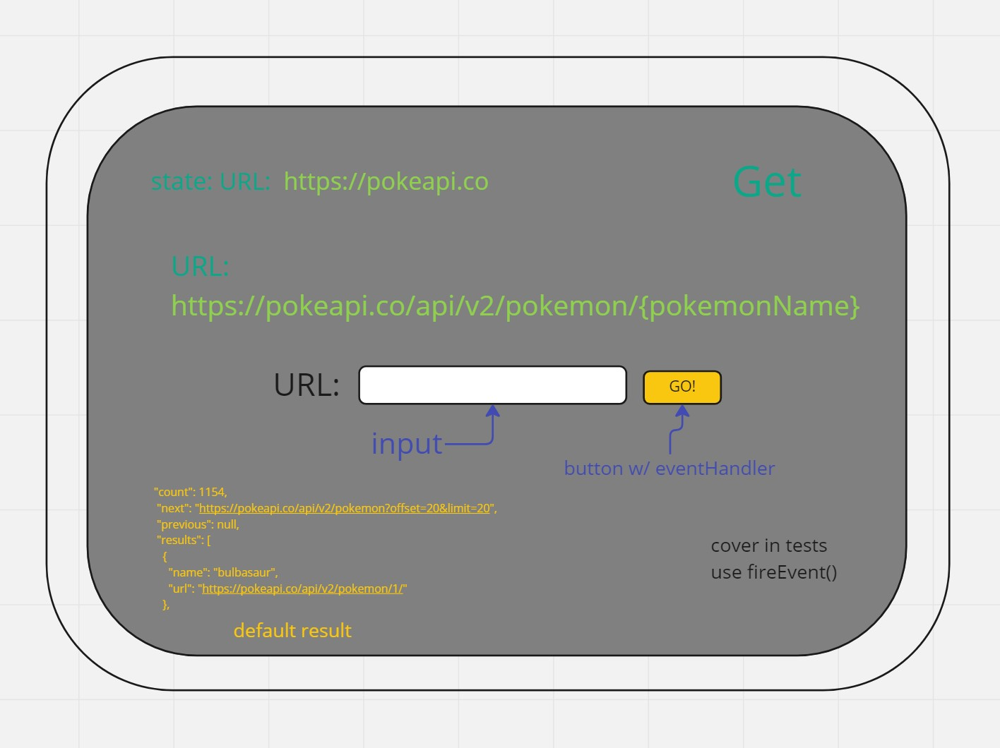
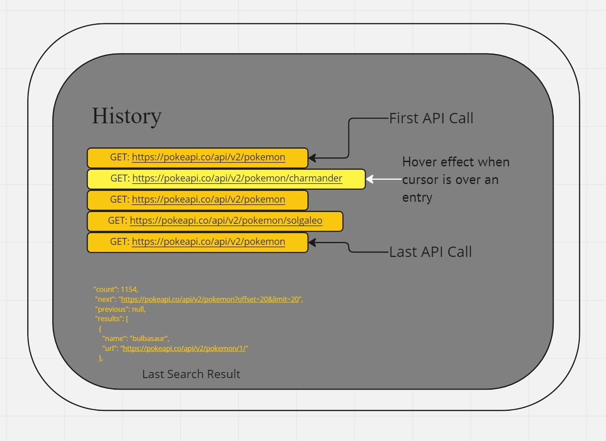

# RESTy

## Author: Trace Dugar

## Collaborators

- Hunter Fehr
- Joseph Zabaleta

## Links and Resources

- [Github Repo](https://github.com/TraceDugar/RESTy)
- [Live Deployment](https://resty-trace-d.onrender.com)

#### Running Application

- `npm start`
- Get method URL: https://pokeapi.co/api/v2/pokemon/

After the backlash enter a Pokemon's name for data about that particular Pokemon. API does not cover Pokemon from Scarlet or Violet.

#### Features and Routes

- Feature 1: Framework for App
- Feature 2: Persists Highlight on selected methods
- Feature 3: Makes Call to Pokemon API
- Feature 4: Shows the user step by step history
- Feature 5: Clickable buttons take you to a previous step in search history.

#### Tests

- Add test for forms

#### UML

